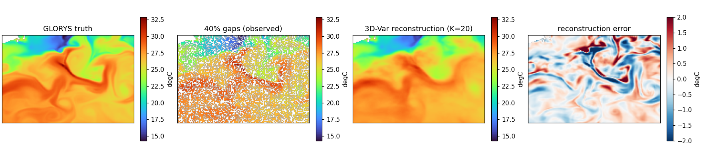
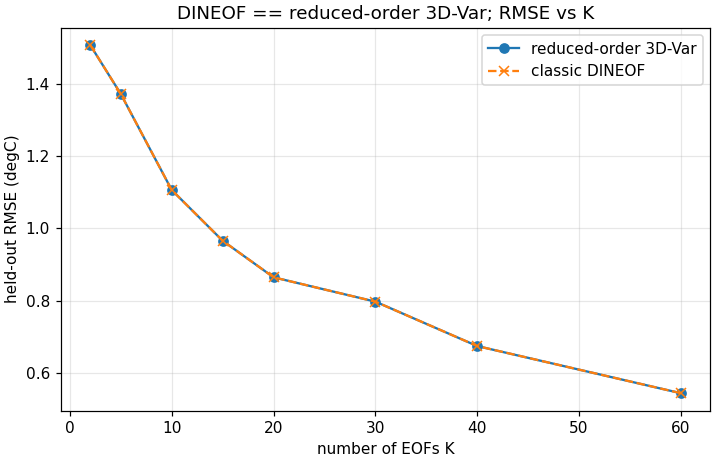

# DINEOF for Mercator SST — a runnable reduced-order 3D-Var

The companion note [`dineof.md`](dineof.md) lays out the theory: DINEOF is the special case of a reduced-order 3D-Var you get when the basis is an EOF basis and the observation noise goes to zero. That note is written against a *target* library stack (`gauss_flows.GaussianPCA.from_data`, `vardax.ThreeDVar`, `somax.SpatialBasis`) whose specific APIs are not all built yet.

This note is the **runnable counterpart**. It implements the same math directly in NumPy on a real gap-free Mercator/GLORYS SST field, punches synthetic cloud-like holes, reconstructs them, and scores the result against the held-out truth. The core lives in [`scripts/dineof_core.py`](../scripts/dineof_core.py) — about forty lines of linear algebra — and doubles as the reference implementation those library APIs should grow toward.

The headline result, established below on real data: the reduced-order 3D-Var and the classic DINEOF alternating projection produce **identical** reconstructions in the noiseless limit, to floating-point precision.

## 1. The data — gap-free Mercator SST as ground truth

Mercator GLORYS12V1 (`cmems_mod_glo_phy_my_0.083deg_P1D-m`) is daily-mean, 1/12° model reanalysis: it is **gap-free**, which is exactly what we want for a controlled experiment. We pull one year of surface potential temperature over a Gulf Stream box — a region with strong, low-rank SST variability — then hide pixels ourselves so we always know the truth at the gaps.

Download once (requires Copernicus Marine credentials):

```bash
pixi run python projects/interpolation/scripts/download_glorys_sst.py
```

```{code-cell} python
import sys
from pathlib import Path

sys.path.insert(0, str(Path.cwd().parents[0] / "scripts"))  # import dineof_core

import numpy as np
import xarray as xr
import matplotlib.pyplot as plt

import dineof_core as dc

ds = xr.open_dataset("../data/glorys_sst_gulfstream_2019.nc")
cube = ds["thetao"].squeeze("depth").values        # (T, H, W) = (365, 97, 145)
T, H, W = cube.shape
X, ocean = dc.fields_to_matrix(cube)               # (T, N) over ocean pixels only
print(f"cube {cube.shape}  ->  matrix {X.shape}  (land dropped, N={X.shape[1]})")
print(f"SST anomaly std (scale reference): {X.std():.3f} degC")
```

Flattening to a `(T, N)` matrix over the ocean pixels is all the "model" the static problem needs — each row is one daily snapshot, each column one pixel's time series.

## 2. The EOF basis — a truncated SVD *is* the background covariance

The EOF basis is the principal subspace of the snapshot ensemble, which is exactly what a truncated SVD of the centred matrix gives. Writing $x = x_b + \Phi w$ with $w \sim \mathcal{N}(0, \Lambda)$ induces the low-rank background covariance $B = \Phi \Lambda \Phi^\top$ — the leading EOFs are the synthesis dictionary $\Phi$, and the PC variances $\Lambda = s^2/(T-1)$ are the coefficient prior.

```{code-cell} python
basis = dc.fit_eofs(X, K=20)    # top-20 EOFs + variances from the centred SVD
total_var = ((X - X.mean(0)) ** 2).sum() / (T - 1)   # sum of all eigenvalues
print("Phi", basis.Phi.shape, " Lambda", basis.Lambda.shape)
print(f"variance captured by 20 EOFs: {basis.Lambda.sum() / total_var:.1%}")
```

This is the data-driven basis. The same `EOFBasis` shape — a mean, an orthonormal dictionary `Phi`, and per-mode variances `Lambda` — would hold an *analytic* basis (a smooth Fourier / kernel-spectral prior) without changing anything downstream. That is the slot `somax.SpatialBasis` is meant to fill (see §6).

## 3. Punch gaps and reconstruct — the reduced-order 3D-Var

We hide 40% of the pixels at random, then minimise, per scene,

$$
J(w) = \tfrac12 \lVert w \rVert^2_{\Lambda^{-1}} + \tfrac{1}{2R} \lVert m \odot (y - x_b - \Phi w) \rVert^2 .
$$

Because the control is the $K$-vector $w$ (here $K=20$), the minimiser is a tiny closed-form ridge solve — no iteration, no $N \times N$ system:

```{code-cell} python
rng = np.random.default_rng(0)
M = dc.punch_gaps(X, frac=0.40, rng=rng)   # boolean: True = observed
Yobs = np.where(M, X, 0.0)                  # gappy field (0 where hidden)

recon = dc.reduced_3dvar_batch(Yobs, M, basis, R=1e-4)
print(f"observed fraction: {M.mean():.2f}")
print(f"held-out RMSE (K=20): {dc.rmse_on_heldout(X, recon, M):.3f} degC")
```

A single scene — truth, the gappy observations, the reconstruction, and the error — shows the front is recovered cleanly from holes, with error concentrated only at the sharpest gradient:



## 4. The equivalence — DINEOF is this 3D-Var as $R \to 0$

Classic DINEOF iterates *project onto the leading EOFs* then *overwrite the observed pixels*. With a fixed basis that alternating projection converges to the $R \to 0$ fixed point of the 3D-Var above. We can check this directly — same gaps, same basis, both methods:

```{code-cell} python
t = 200
x_3dvar = dc.reduced_3dvar(Yobs[t], M[t], basis, R=1e-4)
x_dineof = dc.dineof_classic(Yobs[t], M[t], basis, n_iter=60)
gap = ~M[t]
diff = np.sqrt(np.mean((x_3dvar[gap] - x_dineof[gap]) ** 2))
print(f"|3D-Var - DINEOF| on held-out pixels: {diff:.2e} degC")   # ~0 to fp precision
```

Sweeping the number of EOFs, the two curves lie exactly on top of each other, and the reconstruction error falls steadily — at $K=20$ the held-out RMSE is ~0.86 °C against a field anomaly std of 5.66 °C:



The reduced-order 3D-Var is the *well-posed* form: a single $K$-dimensional solve instead of DINEOF's many alternating-projection sweeps, and with a finite $R$ it does the thing DINEOF cannot — a noise-aware reconstruction that does not interpolate observation error. (With these noise-free GLORYS "observations" the result is insensitive to $R$; the payoff appears once the observations carry noise — the natural next experiment.)

## 5. What is honest about this, and what is not

Two caveats, stated plainly:

- **The basis is fit on the full gap-free truth.** That makes $B$ the *ideal* background covariance, so these numbers are the upper bound on what the method can do, not what you get from gappy data alone. Real DINEOF re-estimates the EOFs from the gappy field by iterating the fill, and selects $K$ by cross-validation on held-out *observed* pixels. The same `reduced_3dvar` call supports that: hold out observed pixels, sweep `K`, minimise reconstruction error.
- **The gaps are i.i.d. pixels (with a crude blob option).** True cloud masks are spatially contiguous; the blob generator here works in flattened-index space, not on the grid. A faithful test would mask contiguous grid windows before flattening.

Neither changes the equivalence — they change how hard the reconstruction is.

## 6. Mapping back to the target library stack

The math here is deliberately small so each piece maps onto exactly one library object in [`dineof.md`](dineof.md). What exists today vs. what each library still needs:

| Step here (`dineof_core`) | Target API in `dineof.md` | Status in the repos |
|---|---|---|
| `fit_eofs` (centred SVD → `Phi`, `Lambda`) | `gauss_flows.GaussianPCA.from_data(ensemble, latent_dim)` | `GaussianPCA` exists (PPCA: `.W`, `.log_sigma`) but is a *learnable* module — **needs a `from_data` SVD constructor** and `.from_base`/`.to_base` whitening helpers. |
| `EOFBasis` (mean + dictionary + per-mode std) | `somax.SpatialBasis(Phi=, std=)` | **Does not exist yet** — no `core/basis.py` in somax. This `EOFBasis` dataclass is the spec. |
| `reduced_3dvar` (ridge solve, finite `R`) | `vardax.ThreeDVar(obs_op, prior_mean, prior_cov_op, obs_cov_op, minimiser)` + `LinearObs` | vardax today is **4D-Var only** (`FourDVarNet`) — **needs a static `ThreeDVar`** and a masked-identity `LinearObs`. The closed-form solve here is its $K$-dim reference. |
| `xr.open_dataset` + `fields_to_matrix` | `xrreader` SST loader | `xrreader` is an **empty stub** — for now plain xarray is the loader; the `download_glorys_sst.py` script is the CMEMS access path. |

So the path forward is incremental and unblocked: this notebook runs end-to-end *now*, and as each library API lands (`GaussianPCA.from_data` → `SpatialBasis` → `ThreeDVar`) we swap one call at a time, re-running this exact experiment as the regression test. Moving on to the dynamical MIOST case is then only a change of which covariance the basis stands in for and whether a `diffrax` rollout sits between the control and the observations.
