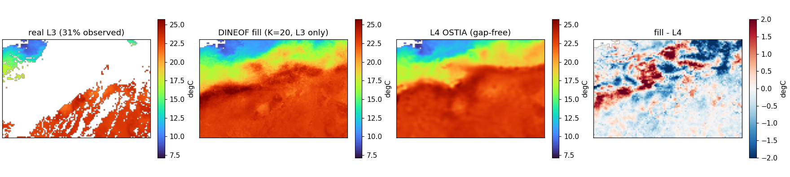

# Real satellite gaps: DINEOF on L3 SST, verified against L4

Notebook [`05_dineof_sst_worked.md`](05_dineof_sst_worked.md) used *synthetic* gaps on a gap-free model field, which is clean but artificial. This one uses **real cloud gaps**: multi-sensor satellite L3S SST, only ~35% of pixels observed per day on average (and as little as ~20% on cloudy winter days). The fill uses **only the gappy L3 data** — iterative DINEOF estimates the EOF basis from the gaps themselves — and we verify the result two ways:

- **Check A — held-out real observations.** Hide a random 20% of the pixels L3 *actually measured*, reconstruct, and score against those held-out measurements. This is verification against real data; L4 is never used.
- **Check B — against the gap-free L4 analysis.** Where L3 is missing (real clouds) but the operational L4 OSTIA analysis has a value, compare our fill to L4. This is the "real gappy data, verified against a gap-free product" comparison.

A caveat we keep in view: **L4 is not ground truth.** It is itself an optimal-interpolation analysis, and it represents daily *foundation* SST while L3 is *sub-skin* at overpass time. So Check A is the rigorous test; Check B is an operational comparison whose error floor is set by the genuine L3–L4 disagreement (printed below as a baseline).

## 1. Data — real L3S gaps and gap-free L4

```bash
pixi run python projects/interpolation/scripts/download_l3_l4_sst.py
```

```{code-cell} python
import sys
from pathlib import Path

sys.path.insert(0, str(Path.cwd().parents[0] / "scripts"))

import numpy as np
import matplotlib.pyplot as plt

import dineof_core as dc
from verify_l3_l4 import load   # shared loader: regrids L4 onto the L3S grid

l3cube, l4cube, hw = load()        # both (T, H, W) in degC; L3 has NaN gaps
H, W = hw
T = l3cube.shape[0]
print(f"L3 cube {l3cube.shape}; mean daily observed fraction: "
      f"{np.mean(np.isfinite(l3cube)):.3f}")
```

L3S comes in Kelvin with NaN where clouds block the view; the loader converts to °C and regrids the finer 0.05° L4 OSTIA field onto the coarser 0.10° L3S grid so the two are pixel-aligned.

## 2. Build the reconstructable domain

We keep the pixels L3 saw at least once over the year (everything else has no information to fill from), and form the `(T, N)` matrix of real observations with its gap mask.

```{code-cell} python
flat3, flat4 = l3cube.reshape(T, -1), l4cube.reshape(T, -1)
domain = np.isfinite(flat3).any(0) & np.isfinite(flat4).any(0)
Y, L4 = flat3[:, domain], flat4[:, domain]
M = np.isfinite(Y)                 # True where L3 observed
print(f"domain N={Y.shape[1]} pixels; overall L3 coverage {M.mean():.3f}")

both = M & np.isfinite(L4)
baseline = np.sqrt(np.mean((Y[both] - L4[both]) ** 2))
print(f"baseline RMSE(L3 obs vs L4) where both exist: {baseline:.3f} degC")
```

That baseline is the floor for Check B: even a perfect reconstruction cannot agree with L4 better than L3 and L4 agree with each other.

## 3. Fill with iterative DINEOF — using only L3

`dineof_iterative` removes each pixel's temporal mean (over its observed days), then iterates *truncated SVD → refill the gaps* until the missing-entry estimate stops moving. The EOF basis is estimated from the gappy matrix itself — no clean training data, no L4.

```{code-cell} python
rng = np.random.default_rng(0)
held = M & (rng.random(M.shape) < 0.20)   # Check-A validation set
M_fit = M & ~held
Yfit = np.where(M_fit, Y, 0.0)

print("K    checkA RMSE(vs held-out L3)   checkB RMSE(fill vs L4 @ gaps)")
gapL4 = (~M) & np.isfinite(L4)            # real cloud pixels where L4 is known
for K in (5, 10, 20, 30, 50):
    filled, _ = dc.dineof_iterative(Yfit, M_fit, K=K, n_iter=100)
    a = np.sqrt(np.mean((filled[held] - Y[held]) ** 2))
    b = np.sqrt(np.mean((filled[gapL4] - L4[gapL4]) ** 2))
    print(f"{K:<3} {a:>22.3f}      {b:>22.3f}")
```

Check A rises then falls with K in the usual bias–variance way — here the bowl bottoms at **K=20 (≈1.03 °C)**: too few EOFs underfit the front, too many fit noise in the sparse columns. Check B tells a different story — it is several times larger and gets *monotonically worse* with K. That divergence is the whole lesson of this notebook (§5).

## 4. A real cloudy day, filled and compared

The four panels — real L3 (mostly cloud), the DINEOF fill from L3 alone, the gap-free L4 analysis, and their difference — show the fill reconstructing the Gulf Stream front through heavy cloud, with the largest fill−L4 differences sitting on the sharp gradient where the two products genuinely differ most:



## 5. Reading the result — the two checks disagree, and that is the point

The numbers from the sweep above:

| | best K | RMSE | what it measures |
|---|---|---|---|
| baseline | — | **0.64 °C** | intrinsic L3↔L4 disagreement where both exist |
| Check A | K=20 | **1.03 °C** | fill vs *held-out real L3* (scattered pixels) |
| Check B | K=5 | **2.44 °C** | fill vs *L4* at real cloud gaps (contiguous voids) |

Check A is the honest skill number — it never touches L4 — and it behaves textbook-perfectly: a bias–variance bowl with a clear optimum at K=20, predicting withheld *measurements* to ~1 °C. At scattered held-out pixels the reduced-order model interpolates well, because each hidden pixel has observed neighbours.

Check B is harder and more revealing. It scores the fill at **large contiguous cloud voids** against the operational L4 analysis, and it is both much larger (2.4–3.6 °C) and *worsens* with K. Two things drive this:

- **Extrapolation, not interpolation.** A cloud hole spanning hundreds of pixels has no nearby data; the fill there rests entirely on the temporal EOF structure and that pixel's mean, and more EOFs extrapolate more aggressively into the void — so the smoothest basis (K=5) lands closest to L4, the opposite of Check A's preference.
- **L4 is not ground truth.** It is a foundation-SST OI analysis built from *many* sensors plus a model background; our fill sees one L3 stream and a handful of EOFs. The gap from the 0.64 °C baseline up to ~2.5 °C is, in large part, the value L4's extra machinery adds exactly where data are absent.

So the takeaway is not a single RMSE but a contrast: a year of one satellite stream and ~20 EOFs reconstructs **real withheld observations** to ~1 °C, yet filling **large real cloud voids** to operational-analysis quality is a genuinely harder problem that wants either a smoother prior, more sensors, or a dynamical model — which is precisely the direction the [`dineof.md`](dineof.md) program heads (richer priors via `somax.SpatialBasis`, a dynamical rollout via the 4D-Var path).

Mechanically this is the same `dineof_core` math as notebook 05; the only change is that the basis is now estimated from the real gaps (`dineof_iterative`) rather than handed in from clean data. That estimator is the missing-data variant `gauss_flows.GaussianPCA.from_data` should grow, and the fill itself is still the `vardax.ThreeDVar` reduced-order solve.
