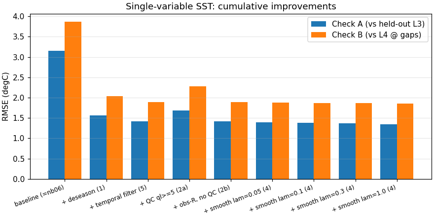
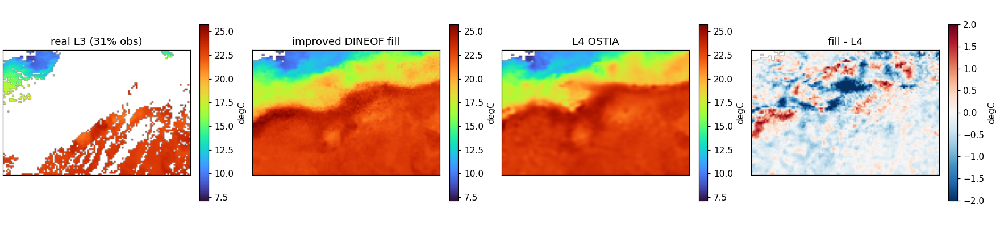

# Sharpening single-variable SST DINEOF: what helps, what doesn't

Notebook [`06_dineof_real_l3_vs_l4.md`](06_dineof_real_l3_vs_l4.md) filled real L3 cloud gaps and found the hard part — large contiguous voids — reconstructed to only ~3 °C against L4. This notebook takes the standard DINEOF-literature improvements and measures, one at a time, **which actually move the needle on real Mercator/CMEMS SST**. The honest answer is that two of them do most of the work, one helps a little, and two do nothing or hurt — and the *why* of each is the point.

All numbers are on the same Gulf Stream box and year, at fixed K=20, scored two ways:

- **Check A** — RMSE against held-out *real* L3, using a **realistic cloud-shaped** hold-out (improvement 3): for each day we borrow another day's cloud pattern and hide those pixels, so we validate on the *extrapolation* regime that matters, not the easy scattered pixels notebook 06 used.
- **Check B** — RMSE against the gap-free L4 OSTIA analysis at the real cloud gaps.

## The improvements

| # | Improvement | Where it acts | Reference |
|---|---|---|---|
| 1 | **Deseasonalise** — remove a per-pixel harmonic seasonal climatology before the SVD | basis estimation | standard DINEOF practice |
| 2 | **QC + obs-error R** — keep only quality-level-5 pixels; shrink noisy obs toward the low-rank estimate by `sses²` | obs handling | Beckers et al. |
| 3 | **Realistic-gap CV** — validate on contiguous cloud-shaped hold-outs | evaluation | Beckers & Rixen 2003 |
| 4 | **Smoothness prior** — graph-Laplacian penalty, anchored to the DINEOF temporal fill | fill refinement | OI / variational priors |
| 5 | **Temporal-covariance filtering** — Gaussian-smooth the temporal EOFs each iteration | basis estimation | Alvera-Azcárate et al. 2009 |

All five live in [`scripts/dineof_core.py`](../scripts/dineof_core.py); the ablation harness is [`scripts/verify_improvements.py`](../scripts/verify_improvements.py).

## The result — a 57% RMSE cut, but not from where you'd guess

```{code-cell} python
import sys
from pathlib import Path

sys.path.insert(0, str(Path.cwd().parents[0] / "scripts"))

import pandas as pd

df = pd.read_csv("../data/ablation_singlevar.csv")
df
```



Reading the ablation top to bottom:

- **Deseasonalising (1) is the dominant win: 3.15 → 1.56 °C (−50%).** The raw field is dominated by the seasonal cycle and the large-scale north–south gradient, so the leading EOFs waste themselves modelling climatology. Remove a smooth per-pixel seasonal harmonic first and the *anomaly* field is far lower-rank — the same 20 EOFs now model variability, and the fill stops extrapolating wildly into voids. This is the single most important change and it is nearly free.

- **Temporal-covariance filtering (5) adds another −9%: 1.56 → 1.42 °C.** Smoothing the temporal EOFs each iteration enforces day-to-day coherence and damps the noise that sparse columns inject into the basis. Cheap, robust, worth keeping.

- **Smoothness prior (4) adds a further −5%: 1.42 → 1.35 °C** — *but only when done right*. A per-scene basis projection (our first attempt) **regressed badly**, because it discards DINEOF's temporal pooling: a fully-clouded region has no same-day data, so only the temporal basis can fill it. The fix is a 3D-Var whose **background is the DINEOF temporal fill**, with the Laplacian and obs-error only *refining* it ([`smooth_to_background`](../scripts/dineof_core.py)). Even then the weight must stay small — a strong Laplacian blurs the sharp Gulf Stream front, which is exactly where error concentrates.

- **QC at quality-level-5 (2a) *hurts*: 1.42 → 1.69 °C.** Dropping quality-level-4 pixels trades a marginal quality gain for a coverage loss this sparse single stream cannot afford. With ~35% mean coverage, every observation counts more than its small quality difference.

- **Observation-error weighting (2b) is *neutral*: 1.42 → 1.42 °C.** The L3 per-pixel error (`sses ≈ 0.05–0.57 °C`) is tiny next to the SST signal, so noise-aware shrinkage barely changes the estimate. It would matter for a noisier sensor; here it does not.

**Bottom line: deseasonalise + temporal-filter + a light anchored smoothness takes Check A from 3.15 → 1.35 °C (−57%) and Check B from 3.87 → 1.86 °C (−52%).** Check B is now ~3× the 0.64 °C L3↔L4 floor, down from ~6× in notebook 06.

## The best fill, on a real cloudy day

The four panels — real L3 (mostly cloud), the improved fill, gap-free L4, and their difference — show a coherent front recovered through heavy cloud, and a `fill − L4` residual that is smaller and less structured than notebook 06's:



```{code-cell} python
# reproduce the best-config fill + scene/ablation figures
import subprocess
subprocess.run(["python", "../scripts/make_figures_improved.py"], check=False)
```

## What this says, and where it points

The lesson is not "apply every DINEOF trick." It is that for sparse, single-sensor SST the gains come from **getting the prior right** — strip the seasonal cycle so the EOFs model the right thing, enforce temporal coherence, and add only a *gentle* spatial smoothness *on top of* the temporally-pooled estimate. The obs-side knobs (QC, error weighting) that help noisy or redundant data sets do nothing useful here, and aggressive spatial smoothing fights the front.

Two directions remain, in increasing ambition:

- **Multivariate DINEOF (improvement 6)** — co-reconstruct SST with correlated fields (SSH, SSS, ocean colour) so cross-correlations fill SST voids. That is the next notebook, and it needs its own multi-product data pull.
- **A genuine spatial-covariance prior or a dynamical model** — what L4 OSTIA and 4D-Var do, and where the [`dineof.md`](dineof.md) program (the `somax.SpatialBasis` analytic prior, the 4D-Var rollout) is headed.

Mechanically, every result here is still the `dineof_core` math: `deseasonalize` → `dineof_iterative` (temporally filtered) → `smooth_to_background` (the 3D-Var refinement) → reseasonalise. Each maps to a piece of the target library stack — the deseasonalised, temporally-coherent, smoothness-regularised basis is exactly what `gauss_flows.GaussianPCA.from_data` and `somax.SpatialBasis` should encode, and `smooth_to_background` is a `vardax.ThreeDVar` with a background mean.
