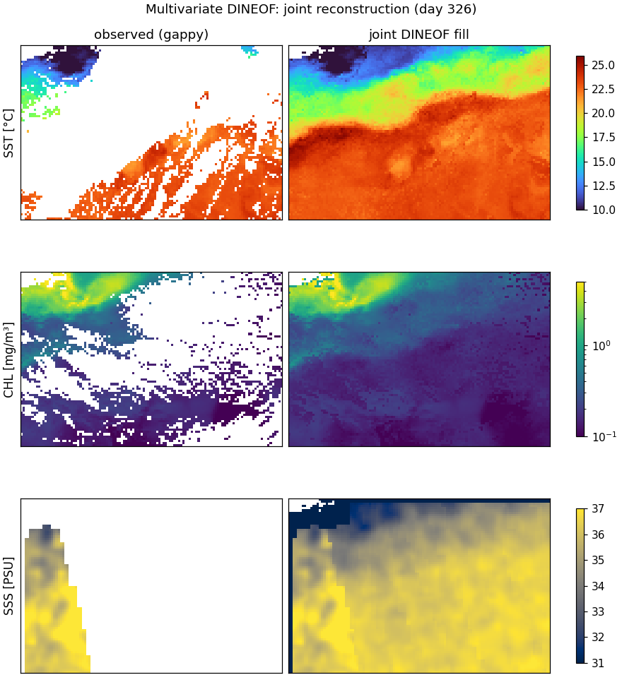
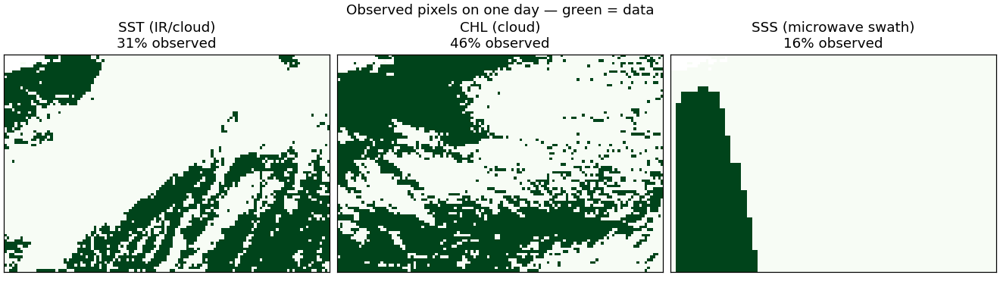
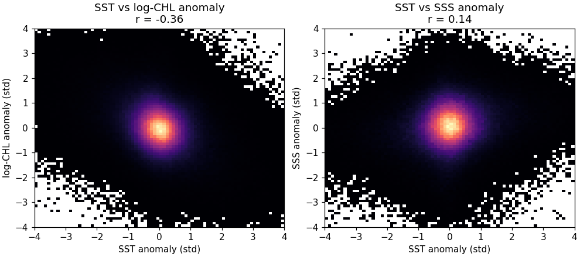
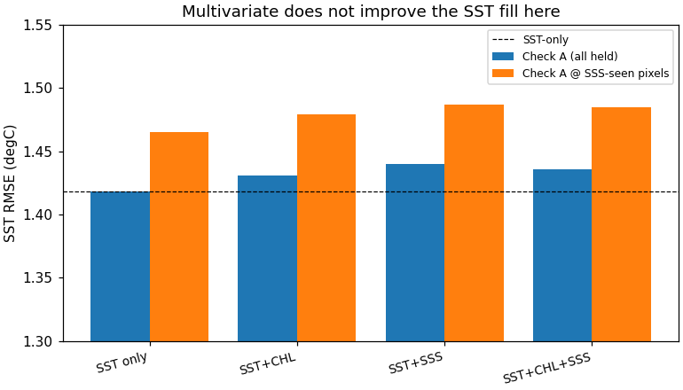

# Multivariate DINEOF for SST: when do CHL and SSS actually help?

The promise of multivariate DINEOF (Alvera-Azcárate et al. 2007) is that reconstructing several correlated ocean fields *jointly* lets an observed variable fill another's gaps. For our SST problem the hope was concrete: ocean-colour chlorophyll traces the same Gulf Stream fronts, and SMOS sea-surface salinity is a **microwave** measurement that **sees through the clouds** that blind SST. So SSS, where present, might constrain SST in the very voids notebook 07 struggled with.

This notebook tests that honestly on real CMEMS L3 data, and the answer is instructive: **here, it does not help** — and the reasons (weak cross-correlation, noisy SSS, shared cloud gaps) are exactly the conditions the method needs and this region does not meet. The value is in seeing *why*, and knowing where it *would* pay off.

The method is in [`dineof_core.multivariate_dineof`](../scripts/dineof_core.py): each variable is deseasonalised and standardised, the blocks are concatenated, and a single DINEOF runs on the stack so shared temporal modes couple the variables. The experiment is [`scripts/verify_multivariate.py`](../scripts/verify_multivariate.py).

## 1. What the joint reconstruction looks like

First, the actual output: one joint DINEOF run reconstructs **all three** variables at once. For a representative cloudy day, each variable's gappy input (left) next to its joint fill (right), in physical units:



The fills are individually plausible — **SST** recovers the Gulf Stream front through heavy cloud, and **CHL** fills into a coherent chlorophyll field that is high in the cold northern water and low in the warm south, the spatial signature of the −0.36 SST–CHL anti-correlation. But look at **SSS**: the input is a *single narrow swath* covering a sliver of the domain, and the "reconstruction" is consequently a smooth, largely climatological field with little fine structure. That picture is the whole story in one panel — SSS simply does not carry enough independent, well-correlated signal to sharpen the SST fill, however cloud-free it is. The rest of the notebook quantifies that.

## 2. Three sensors, three different gap structures

```{code-cell} python
import sys
from pathlib import Path

sys.path.insert(0, str(Path.cwd().parents[0] / "scripts"))

import pandas as pd

cor = pd.read_csv("../data/multivariate_correlations.csv")
cor
```

The coverages tell the first part of the story — SSS is not the coverage saviour we hoped: it is *sparser* than SST (microwave swaths are narrow), and CHL shares SST's clouds almost exactly:



CHL (centre) is cloud-gapped in nearly the same places as SST (left) — so it adds correlated *structure* but little new *coverage*. SSS (right) has genuinely different, cloud-independent gaps, but they are sparse: on a given day SSS sees only a third of the domain.

## 3. The correlations are too weak for a shared-mode model

Joint DINEOF assumes the variables share temporal modes. That pays off only when they are strongly correlated; otherwise the shared modes get spent on each variable's *independent* variance and the primary reconstruction degrades. Our anomaly correlations:



- **SST ↔ CHL ≈ −0.36** — real and physically sensible (cold, upwelled water carries more chlorophyll), but moderate: most of CHL's variability is *not* SST.
- **SST ↔ SSS ≈ +0.14** — weak, and SMOS SSS anomalies are dominated by retrieval noise (the regridded SSS spans an unphysically wide range, std ~1.5 PSU against a real ~0.5 PSU signal).

## 4. The result — no improvement, and weighting can't rescue it

```{code-cell} python
abl = pd.read_csv("../data/ablation_multivariate.csv")
abl
```



Adding CHL, SSS, or both leaves the SST fill **slightly worse**, not better — including at the subset of held pixels where SSS *does* see through the cloud (`checkA @ SSS-seen`). A weighting sweep (up-weighting the SST block so it dominates the joint modes) only drives the result back *toward* the SST-only number: there is no weight at which the covariates add skill. The shared-mode coupling at r ≈ −0.36 / +0.14 costs more in mode dilution than it returns in cross-information.

## 5. When multivariate DINEOF *does* help — and where this points

This is a negative result, not a broken method. The literature gains appear under two conditions this experiment misses:

- **Strong correlation.** Multivariate SST+CHL helps in **eastern-boundary upwelling systems** (Benguela, California, Iberia), where the SST–chlorophyll coupling is far tighter than the −0.36 of a Gulf Stream meander. The same code on an upwelling box would likely show a real gain.
- **Strongly complementary, low-noise coverage.** The cleanest win is not cross-variable at all but **multi-sensor merging of the *same* variable**: several single-sensor L3 SST streams are correlated at r ≈ 1 and have complementary swaths, so a joint DINEOF fills each sensor's gaps with the others'. Our L3S product is already a super-collation of exactly this; doing it explicitly is the productive next step, and `multivariate_dineof` runs it unchanged — just pass one block per sensor.

So the takeaway mirrors notebook 07: the gains come from matching the method to the data's structure. Deseasonalisation helped because SST *is* strongly seasonal; multivariate coupling did not help because these covariates are *not* strongly coupled to SST here. The honest negative is itself the deliverable — and it tells us precisely which experiment (upwelling region, or multi-sensor SST) to run next.

Mechanically, `multivariate_dineof` is the same `dineof_iterative` on a stacked matrix; in the [`dineof.md`](dineof.md) library terms it is a single `gauss_flows.GaussianPCA.from_data` over a block-structured state, and the per-variable standardisation is the block-diagonal whitening that `somax.SpatialBasis` would carry. Figures are produced by [`scripts/make_figures_multivariate.py`](../scripts/make_figures_multivariate.py).
