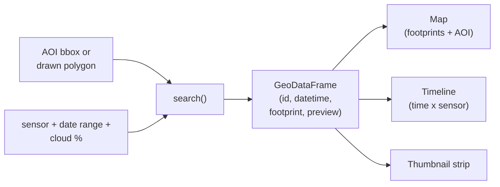

# Satellite time-series viewer

> Preview intersecting satellite imagery for an AOI **before** downloading.

Pick a sensor, draw an AOI, set a date range, and get back the
**footprints**, **timeline**, and **preview thumbnails** of every
intersecting scene — without a single full-resolution download. The
goal is fast inspection: "is there usable imagery here at this time?"
before paying the bandwidth bill.



## Scope

**Polar-orbiting and tasked sensors only**, via the Microsoft Planetary
Computer STAC API (anonymous read, no auth required):

| Key                | Description                                                       |
|--------------------|-------------------------------------------------------------------|
| `sentinel-2-l2a`   | Sentinel-2 L2A surface reflectance (10-60 m, ~5 day revisit)      |
| `sentinel-1-grd`   | Sentinel-1 C-band SAR GRD (10 m, all-weather)                     |
| `landsat-c2-l2`    | Landsat Collection-2 L2 surface reflectance (30 m, ~16 day)       |
| `modis-09a1`       | MODIS Terra/Aqua 8-day surface reflectance (500 m)                |
| `emit-l2a-rfl`     | EMIT L2A imaging spectrometer reflectance (60 m, tasked)          |

Geostationary platforms (GOES, Himawari, Meteosat) are **out of scope** —
their ~5-15 minute cadence makes "is there imagery over my AOI?" a
trivially-yes question for any point inside the scan sector, so the
preview-before-download workflow doesn't add value there.

## Subapps

Three presentation layers over the same `satellite_viewer.search`
backend, so the discovery logic stays in one place.

### Panel

A standalone web app with linked map / timeline / thumbnail panes
(leafmap + holoviews + tabulator).

```bash
pixi run -e satellite-viewer panel-app
# or
pixi run -e satellite-viewer panel serve \
    projects/satellite_viewer/apps/panel_app.py --show
```

Source: [`apps/panel_app.py`](apps/panel_app.py).

### Streamlit

A single-file rerun-on-change script — folium map with a Draw plugin,
altair timeline, thumbnail grid.

```bash
pixi run -e satellite-viewer streamlit-app
# or
pixi run -e satellite-viewer streamlit run \
    projects/satellite_viewer/apps/streamlit_app.py
```

Source: [`apps/streamlit_app.py`](apps/streamlit_app.py).

### Jupyter notebook

A lighter-weight in-notebook variant using ipywidgets + leafmap + matplotlib.

```bash
pixi run -e satellite-viewer lab
# then open projects/satellite_viewer/notebooks/viewer.py — JupyterLab
# with the jupytext extension renders the .py as a notebook.
```

Source: [`notebooks/viewer.py`](notebooks/viewer.py) — paired as a
jupytext py:percent script. The repo does not ship a checked-in
`.ipynb`; opening the `.py` with the jupytext extension installed (it
is, in this pixi env) gives the notebook experience directly. If you
prefer a one-off `.ipynb` artifact:

```bash
pixi run -e satellite-viewer jupytext --to ipynb \
    projects/satellite_viewer/notebooks/viewer.py
```

## Layout

```
projects/satellite_viewer/
├── pyproject.toml
├── README.md
├── src/satellite_viewer/
│   ├── __init__.py
│   ├── sensors.py       # registry of supported sensors
│   └── search.py        # one entry point: search(sensor, aoi, start, end)
├── tests/
│   └── test_sensors.py  # offline registry sanity checks
├── apps/
│   ├── panel_app.py     # Panel subapp
│   └── streamlit_app.py # Streamlit subapp
└── notebooks/
    └── viewer.py        # jupytext py:percent notebook
```

## Public API

```python
from datetime import datetime
from shapely.geometry import box
from satellite_viewer import SENSORS, search

aoi = box(-120.20, 38.95, -119.90, 39.25)  # Lake Tahoe
hits = search(
    "sentinel-2-l2a",
    aoi,
    datetime(2024, 6, 1),
    datetime(2024, 9, 1),
    cloud_lt=20,
    max_items=50,
)
# -> GeoDataFrame[id, datetime, geometry, sensor, cloud_cover, preview_url]
```

Output schema is identical across sensors so the UI code is one
render path. `preview_url` is a signed Planetary Computer
`rendered_preview` href — fetch it directly to get a small RGB PNG.

## Credentials

Anonymous read of the Planetary Computer STAC works without any
credentials — the default `search()` call does not need them. The
`satellite_viewer.credentials` module is here for downstream stages
(NASA Earthdata via `earthaccess`, Google Earth Engine, MPC private
collections) where authentication *is* required.

Three layers, in increasing order of friction:

1. **`.env` file at repo root.** Copy `.env.example` to `.env` (it's
   gitignored) and fill in the variables for the services you actually
   use. `satellite_viewer.credentials` loads it automatically via
   `python-dotenv`.
2. **Service-native files** as fallback — `~/.netrc` for Earthdata,
   `~/.config/earthengine/credentials` for an interactive GEE login,
   `~/.aws/credentials` for AWS. Each accessor falls back to these
   when env vars aren't set, so contributors who already ran the
   service's own auth command don't need to duplicate.
3. **Pixi activation.** The `satellite-viewer` env sources
   `.env` on activation (see `scripts/load_env.sh`), so shell-level
   tools (`earthengine`, `aws`, `gcloud`) see the same vars without
   needing Python in the loop.

Use the module like:

```python
from satellite_viewer import credentials, CredentialsMissingError

try:
    creds = credentials.earthdata()
except CredentialsMissingError as exc:
    print(exc)   # error text contains sign-up + setup instructions
    raise
```

Available accessors:

| Function                              | Returns                  | When missing           |
|---------------------------------------|--------------------------|------------------------|
| `credentials.earthdata()`             | `EarthdataCreds`         | raises (with sign-up)  |
| `credentials.gee_credentials_path()`  | `Path` to JSON or creds  | raises (with sign-up)  |
| `credentials.planetary_computer_key()`| `str` or `None`          | returns `None`         |

`CredentialsMissingError` always includes both the env-var name to
set and the service's signup / docs URL, so the user knows what to
do without leaving the traceback.

For CI: set the same env vars as GitHub Actions secrets; the module
reads them identically with or without `.env` present.

## Reproducing

```bash
pixi install -e satellite-viewer
pixi run -e satellite-viewer test-satellite-viewer
```

For non-pixi users, the standalone `pyproject.toml` here pins the
same deps; `uv pip install -e projects/satellite_viewer[panel,streamlit,notebook]`
into an activated venv works equivalently.

## Why not just plug `geocatalog` in directly?

[`geocatalog`](https://github.com/jejjohnson/geocatalog) is the right
primitive once you've decided what to keep — it builds a queryable
index over a chosen collection of files. The viewer's job is
**upstream of that**: figure out *which* scenes you'd want to put in a
catalog in the first place. After the user clicks "Search" and likes
what they see, the natural next step is to hand the returned
GeoDataFrame to `geocatalog.from_stac_items(...)` and proceed from
there.
