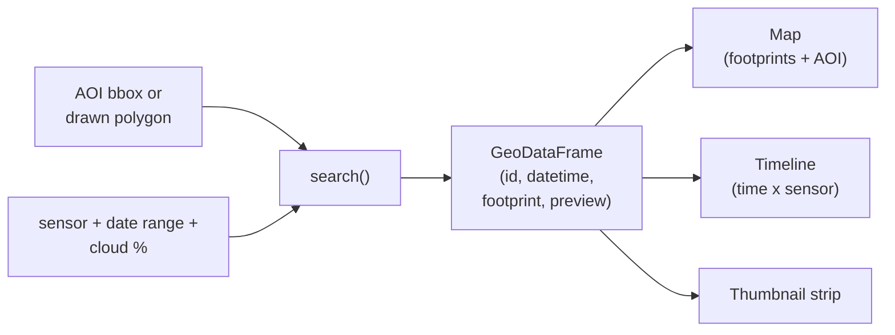

# Satellite time-series viewer

> Preview intersecting satellite imagery for an AOI **before** downloading.

Pick a sensor, draw an AOI, set a date range, and get back the
**footprints**, **timeline**, and **preview thumbnails** of every
intersecting scene — without a single full-resolution download. The
goal is fast inspection: "is there usable imagery here at this time?"
before paying the bandwidth bill.



## Scope

**Polar-orbiting and tasked sensors only**, via the Microsoft Planetary
Computer STAC API (anonymous read, no auth required):

| Key                | Description                                                       |
|--------------------|-------------------------------------------------------------------|
| `sentinel-2-l2a`   | Sentinel-2 L2A surface reflectance (10-60 m, ~5 day revisit)      |
| `sentinel-1-grd`   | Sentinel-1 C-band SAR GRD (10 m, all-weather)                     |
| `landsat-c2-l2`    | Landsat Collection-2 L2 surface reflectance (30 m, ~16 day)       |
| `modis-09a1`       | MODIS Terra/Aqua 8-day surface reflectance (500 m)                |
| `emit-l2a-rfl`     | EMIT L2A imaging spectrometer reflectance (60 m, tasked)          |

Geostationary platforms (GOES, Himawari, Meteosat) are **out of scope** —
their ~5-15 minute cadence makes "is there imagery over my AOI?" a
trivially-yes question for any point inside the scan sector, so the
preview-before-download workflow doesn't add value there.

## Subapps

Two presentation layers over the same `satellite_viewer.search`
backend, so the discovery logic stays in one place.

### Panel

A standalone web app with linked map / timeline / thumbnail panes.

```bash
pixi run -e satellite-viewer panel-app
# or
pixi run -e satellite-viewer panel serve \
    projects/satellite_viewer/apps/panel_app.py --show
```

Source: [`apps/panel_app.py`](apps/panel_app.py).

### Jupyter notebook

A lighter-weight in-notebook variant using ipywidgets + leafmap + matplotlib.

```bash
pixi run -e satellite-viewer lab
# then open projects/satellite_viewer/notebooks/viewer.ipynb
```

Source: [`notebooks/viewer.py`](notebooks/viewer.py) — paired as a
jupytext py:percent script. Open it in JupyterLab with the jupytext
extension and it appears as a normal notebook.

## Layout

```
projects/satellite_viewer/
├── pyproject.toml
├── README.md
├── src/satellite_viewer/
│   ├── __init__.py
│   ├── sensors.py       # registry of supported sensors
│   └── search.py        # one entry point: search(sensor, aoi, start, end)
├── tests/
│   └── test_sensors.py  # offline registry sanity checks
├── apps/
│   └── panel_app.py     # Panel subapp
└── notebooks/
    └── viewer.py        # jupytext py:percent notebook
```

## Public API

```python
from datetime import datetime
from shapely.geometry import box
from satellite_viewer import SENSORS, search

aoi = box(-120.20, 38.95, -119.90, 39.25)  # Lake Tahoe
hits = search(
    "sentinel-2-l2a",
    aoi,
    datetime(2024, 6, 1),
    datetime(2024, 9, 1),
    cloud_lt=20,
    max_items=50,
)
# -> GeoDataFrame[id, datetime, geometry, sensor, cloud_cover, preview_url]
```

Output schema is identical across sensors so the UI code is one
render path. `preview_url` is a signed Planetary Computer
`rendered_preview` href — fetch it directly to get a small RGB PNG.

## Reproducing

```bash
pixi install -e satellite-viewer
pixi run -e satellite-viewer test-satellite-viewer
```

For non-pixi users, the standalone `pyproject.toml` here pins the
same deps; `uv pip install -e projects/satellite_viewer[panel,notebook]`
into an activated venv works equivalently.

## Why not just plug `geocatalog` in directly?

[`geocatalog`](https://github.com/jejjohnson/geocatalog) is the right
primitive once you've decided what to keep — it builds a queryable
index over a chosen collection of files. The viewer's job is
**upstream of that**: figure out *which* scenes you'd want to put in a
catalog in the first place. After the user clicks "Search" and likes
what they see, the natural next step is to hand the returned
GeoDataFrame to `geocatalog.from_stac_items(...)` and proceed from
there.
