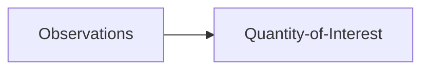

> Some learning problems that will be outlined in this document include:
> 1. State Estimation
> 2. Parameter Estimation
> 3. Parameter & State Estimation (Bi-Level Optimization)
> 3. Objective-Based Function
> 4. Gradient Learning


```{mermaid}
graph LR
    State --> Quantity-of-Interest
    State --> Observations
```

---
## State Estimation

This is the first example problem we may want to solve is the state estimation problem. In this case, we may have some prior on the state, some conditional distribution on the quantity of interest and some observations. We can write the joint probability of everything as

$$
p(\boldsymbol{u},\boldsymbol{y},\boldsymbol{z}) =
p(\boldsymbol{u}|\boldsymbol{z})
p(\boldsymbol{y}|\boldsymbol{z})
p(\boldsymbol{z})
$$

We are interested in finding the best state given the QOI and observations. So the posterior probability of the state given the QOI and observations is given by


$$
\begin{aligned}
p(\boldsymbol{z}|\boldsymbol{u},\boldsymbol{y})
&= \frac{1}{\mathbf{Z}}
p(\boldsymbol{u}|\boldsymbol{z})
p(\boldsymbol{y}|\boldsymbol{z})
p(\boldsymbol{z})
\end{aligned}
$$

where $\mathbf{Z}$ is a normalizing factor which integrates out the QOI and observations

$$
\mathbf{Z} =
\int_\mathcal{U}
\int_\mathcal{Y}
p(\boldsymbol{y}|\boldsymbol{z})
p(\boldsymbol{u}|\boldsymbol{z})
p(\boldsymbol{z})
d\boldsymbol{u}d\boldsymbol{y}
$$

In theory, this normalizing factor is constant. We typically only work with the Maximum A Posteriori (MAP) approximation which utilizes the fact that we can simple use proportionalities for the posterior.

$$
\begin{aligned}
p(\boldsymbol{z}|\boldsymbol{u},\boldsymbol{y})
&\propto
p(\boldsymbol{u}|\boldsymbol{z})
p(\boldsymbol{y}|\boldsymbol{z})
p(\boldsymbol{z})
\end{aligned}
$$

**Note**: we chose the MAP estimation because it is the simplest way to minimize this cost function. However, we can utilise other optimization schemes, e.g. Laplace approximation, variational Bayes, or MCMC/HMC.

Now, we need to set distributions and functions for each of the terms on the RHS of the equation.

---

### Prior

Firstly, we need a prior distribution over our state. This can also be described through some parameters that are previously learned.

$$
\boldsymbol{z} \sim p(\boldsymbol{z}; \boldsymbol{\theta})
$$

For example, we could have a uniform prior or a Gaussian prior. We can also vary the complexity of the simple prior. For example, the Gaussian prior could have a full covariance, a diagonal covariance or a scalar covariance. Let's call this the **prior** term.

$$
p(\boldsymbol{z}; \boldsymbol{\theta})
\propto
\exp \left( - \boldsymbol{P}(\boldsymbol{z};\boldsymbol{\theta})  \right)
$$

---

### Data Fidelity

Secondly, we need a likelihood function for the conditional distribution of the observations given the state.

$$
\boldsymbol{y} \sim p(\boldsymbol{y}|\boldsymbol{z}; \boldsymbol{\theta})
$$

We can define an objective function that can determine the faithfulness of the learned transformation between the state and the observations. It is a loss function that encapsulates the data likelihood, i.e. the likelihood that the observations is generated from the function applied to the state. Let's call this the **data fidelity** term.

$$
p(\boldsymbol{y}|\boldsymbol{z}; \boldsymbol{\theta})
\propto
\exp \left( - \boldsymbol{D}(\boldsymbol{z};\boldsymbol{\theta})  \right)
$$


---

### Regularization

Lastly, we need a likelihood function for the conditional distribution of the QOI given the state.

$$
\boldsymbol{u} \sim p(\boldsymbol{u}|\boldsymbol{z}; \boldsymbol{\theta})
$$


We can also define an objective function that can determine the faithfulness of the learning transformation between the state and the prior. Let's call this the **regularization** term.

$$
p(\boldsymbol{u}|\boldsymbol{z}; \boldsymbol{\theta})
\propto
\exp \left( - \boldsymbol{R}(\boldsymbol{z};\boldsymbol{\theta})  \right)
$$

---

### Objective Function

Finally, we can describe the full objective function which encapsulates all of the terms described above: 1) the *prior* term, 2) the *data fidelity*, and 3) the *regularization* terms.


$$
\begin{aligned}
p(\boldsymbol{z}|\boldsymbol{u},\boldsymbol{y})
&\propto
p(\boldsymbol{y}|\boldsymbol{z})
p(\boldsymbol{u}|\boldsymbol{z})
p(\boldsymbol{z})\\
&\propto
\exp \left( -
\boldsymbol{P}(\boldsymbol{z};\boldsymbol{\theta}) -
\boldsymbol{D}(\boldsymbol{z};\boldsymbol{\theta}) -
\boldsymbol{R}(\boldsymbol{z};\boldsymbol{\theta})  \right)
\\
&\propto \exp\left( - \boldsymbol{J}(\boldsymbol{z}; \boldsymbol{\theta}) \right)
\end{aligned}
$$

where we have our final objective function, $\boldsymbol{J}$.
$$
\boldsymbol{J}(\boldsymbol{z};\boldsymbol{\theta}) =
\boldsymbol{D}(\boldsymbol{z};\boldsymbol{\theta})  +
\boldsymbol{R}(\boldsymbol{z};\boldsymbol{\theta}) +
\boldsymbol{P}(\boldsymbol{z};\boldsymbol{\theta})
$$

This is also known as an energy function as it is related to the Boltzmann or Gibbs distribution. And finally, we can define some minimization function to find the best state, $\boldsymbol{z}$, given the observations/data, $\boldsymbol{y}$, and the prior, $\boldsymbol{u}$.

$$
\boldsymbol{z}^* =
\underset{\boldsymbol{z}}{\text{argmin}}
\hspace{2mm}
\boldsymbol{J}(\boldsymbol{z};\boldsymbol{\theta})
$$

**Note**: we have assumed a MAP estimation where we assume that there is a unique solution to the optimization problem. However, we know that this is not necessarily the best solution. We could use other inference methods like MCMC/HMC sampling or Stochastic Gradient Langevin Dynamics (SGLD).


---

## Parameter Estimation

In the section regarding state estimation, it was elluded to throughout the section that we have parameters throughout the In addition, we have parameters throughout the assumptions like the data fidelity and regularization terms. Given some example data

$$
\mathcal{D} = \left\{ \boldsymbol{u}_n, \boldsymbol{y}_n \right\}_{n=1}^N
$$

we can define the interested posterior (of the parameters), as:

$$
\begin{aligned}
p(\boldsymbol{\theta}|\mathcal{D}, \boldsymbol{z})
&= \frac{1}{\mathcal{Z}}
p(\boldsymbol{y}|\boldsymbol{z},\boldsymbol{\theta})
p(\boldsymbol{u}|\boldsymbol{z},\boldsymbol{\theta})
p(\boldsymbol{z}|\boldsymbol{\theta})
p(\boldsymbol{\theta})\\
&\propto
p(\boldsymbol{y}|\boldsymbol{z},\boldsymbol{\theta})
p(\boldsymbol{u}|\boldsymbol{z},\boldsymbol{\theta})
p(\boldsymbol{z}|\boldsymbol{\theta})
p(\boldsymbol{\theta})
\end{aligned}
$$

**Note**: we impose the fact that the transformations between the state and the observations and prior are independent of each other.


Similar to the state estimation section, we can define each of these quantities above with proper distributions and functions.

$$
\begin{aligned}
\text{Data Fidelity}: &&
\boldsymbol{y} &\sim
p(\boldsymbol{y}|\boldsymbol{z}; \boldsymbol{\theta}) &&
p(\boldsymbol{y}|\boldsymbol{z}; \boldsymbol{\theta})
\propto
\exp \left( - \boldsymbol{D}(\boldsymbol{z};\boldsymbol{\theta})  \right)\\
\text{Regularization}: &&
\boldsymbol{u} &\sim
p(\boldsymbol{u}|\boldsymbol{z}; \boldsymbol{\theta}) &&
p(\boldsymbol{u}|\boldsymbol{z}; \boldsymbol{\theta})
\propto
\exp \left( - \boldsymbol{R}(\boldsymbol{z};\boldsymbol{\theta})  \right) \\
\text{State Prior}: &&
\boldsymbol{z} &\sim
p(\boldsymbol{z}| \boldsymbol{\theta}) &&
p(\boldsymbol{z}| \boldsymbol{\theta})
\propto
\exp \left( - \boldsymbol{P_z}(\boldsymbol{z};\boldsymbol{\theta})  \right)\\
\text{Params Prior}: &&
\boldsymbol{\theta} &\sim
p(\boldsymbol{\theta}; \boldsymbol{\alpha}) &&
p(\boldsymbol{\theta}; \boldsymbol{\alpha})
\propto
\exp \left( - \boldsymbol{P_\theta}(\boldsymbol{\theta};\boldsymbol{\alpha})  \right)\\
\end{aligned}
$$


---

### Objective Function

Finally, we can describe the full objective function which encapsulates all of the terms described above: 1) the *prior* term, 2) the *data fidelity*, 3) the *regularization* terms, and 4) the *prior* term for the parameters. Now, we can define some objective function which we can minimized to find the best parameters for the likelihood and prior terms. This leads to the MAP estimation whereby we find the best parameters given the data.

$$
\boldsymbol{L}(\boldsymbol{\theta};\mathcal{D}) =
\boldsymbol{D}(\boldsymbol{\theta};\boldsymbol{y})  +
\boldsymbol{R}(\boldsymbol{\theta};\boldsymbol{u}) +
\boldsymbol{P}_{z}(\boldsymbol{\theta};\boldsymbol{z}) +
\boldsymbol{P}_{\theta}(\boldsymbol{\theta};\boldsymbol{\alpha})
$$

We can do the minimization wrt the parameters for both the MAP estimation and the MLE estimation.

$$
\boldsymbol{\theta}^* =
\underset{\boldsymbol{\theta}}{\text{argmin}}
\hspace{2mm}
\boldsymbol{L}(\boldsymbol{\theta};\mathcal{D})
$$

**Note**: We have an extra prior term which is a prior on the parameters. We can always put a prior on the parameters and this leads to more advanced inference regimes like MCMC/HMC and SGLD. However, in general, we normally leave a uniform prior on these parameters and simple use the MLE procedure.  See [this tutorial](https://jejjohnson.github.io/research_notebook/content/notes/bayesian/inference.html) for more information about the difference between MLE and MAP.


---

## Parameter & State Estimation

In the above cases, we were looking at parameter estimation and state estimation separately. However, if we wish to learn this jointly. This ultimately leads to a *bi-level optimization* scheme whereby we need to find the best parameters, $\boldsymbol{\theta}$, given the state estimation. So we can define some objective function

$$
\begin{aligned}
\boldsymbol{\theta}^* &=
\underset{\boldsymbol{\theta}}{\text{argmin}}
\hspace{2mm}
\boldsymbol{L}(\boldsymbol{\theta};\mathcal{D}) \\
\boldsymbol{z}^*(\boldsymbol{\theta}) &=
\underset{\boldsymbol{z}}{\text{argmin}}
\hspace{2mm}
\boldsymbol{J}(\boldsymbol{z};\boldsymbol{\theta})
\end{aligned}
$$

This can be a good strategy to design synthetic experiments that mimic the real experiments to learn approprate priors. And then we can directly apply this for a state estimation problem with the learned prior.

**Note**: the difficulty in this scheme is how we can calculate the gradients of the loss function wrt an input that is the solution to another minimization scheme. Using the chain rule, we have

$$
\frac{\partial \boldsymbol{L}}{\partial \boldsymbol{\theta}} =
\frac{\partial \boldsymbol{L}}{\partial \boldsymbol{z}}
\frac{\partial \boldsymbol{z}}{\partial \boldsymbol{\theta}}
$$

which means we need to calculate the derivative $\frac{\partial \boldsymbol{z}}{\partial \boldsymbol{\theta}}$; the solution to the minimization problem. aka [argmin differentiation](https://mblondel.org/talks/mblondel-ulisboa-2021-06.pdf). There are methods to do this like unrolling or implicit differentiation.

---
## Objective-Based Learning



In the above sections, we were rather complete for how we can estimate the state which incorporates a conditional prior and a condictional observation operator. However, this can be a rather involved operation with a lot of moving pieces. There may be many cases when we don't have strong prior knowledge nor do we have any interest in estimating a state. Perhaps, we just have many/some samples available.


$$
\mathcal{D} = \left\{ \boldsymbol{u}_n, \boldsymbol{y}_n \right\}_{n=1}^N
$$

where we want to learn a conditional distribution that maps the observations to the QOI directly.

$$
\boldsymbol{u} \sim p(\boldsymbol{u}|\boldsymbol{y};\boldsymbol{\theta})
$$

We can define the interested posterior (of the parameters) directly trying to estimate our quantity of interest.

$$
\begin{aligned}
p(\boldsymbol{\theta}|\mathcal{D})
&= \frac{1}{\mathbf{Z}}
p(\boldsymbol{u}|\boldsymbol{y},\boldsymbol{\theta})
p(\boldsymbol{\theta})
\propto
p(\boldsymbol{u}|\boldsymbol{y},\boldsymbol{\theta})
p(\boldsymbol{\theta})
\end{aligned}
$$

Similar to the parameter estimation section, we can define an objective function which encapsulates all of our knowledge

$$
\boldsymbol{L}(\boldsymbol{\theta};\mathcal{D}) =
\boldsymbol{D}(\boldsymbol{\theta};\boldsymbol{u},\boldsymbol{y})  +
\boldsymbol{P}_{\theta}(\boldsymbol{\theta};\boldsymbol{\alpha})
$$

Then we can write down the same objective function

$$
\boldsymbol{\theta}^* =
\underset{\boldsymbol{\theta}}{\text{argmin}}
\hspace{2mm}
\boldsymbol{L}(\boldsymbol{\theta};\mathcal{D})
$$

If we have enough data, then it might not be necessary to try and solve the inversion problem directly and instead we can try to estimate our QOI directly without utilizing an intermediate state space.


---
## Gradient Learning

```{mermaid}
graph LR
    State-Init --> ...
    ... --> State-Solution
    ... --> ...
```

In many cases, we need to find the best state given the state (and parameters). Most gradient update schemes look like the following where it is fixed.


To find the optimal solution of this problem, we can write it down as:

$$
\boldsymbol{z}^{(k+1)} = \boldsymbol{z}^{(k)} + \boldsymbol{g}_k
$$

where $\boldsymbol{g}_k$ is some result of a generalized gradient operator

$$
[\boldsymbol{g}_k, \boldsymbol{h}_{k+1}] = \boldsymbol{g}(\boldsymbol{\nabla_z}\boldsymbol{J},\boldsymbol{h}_k, k; \boldsymbol{\phi})
$$

where $k$ is the iteration, $\boldsymbol{\phi}$ are the parameters of the gradient operator, and $\boldsymbol{h}$ is the hidden state.

$$
\boldsymbol{L}_g\left(\boldsymbol{\phi} \right)
$$
