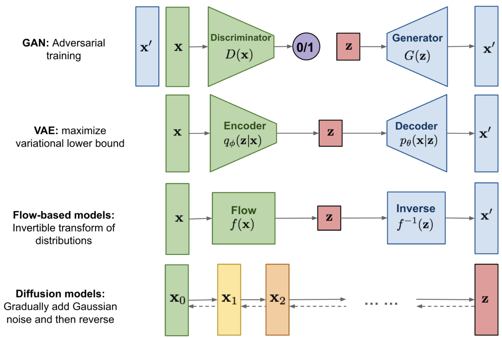

# Generative Models


:::{figure-md} markdown-fig


This figure was taken from [Lilians blog]().
:::

$$
p(x,z) = p(x,z)p(z)
$$

---

## Quantities of Interest

By having this generative model, we are typically only interested in two things: sampling and density estimation.

### Sampling

We want to be able to generate samples of, $x'$, such that they are indistinguishable from our real data distribution, $x$.

$$
x' \sim P_X(\boldsymbol{\theta})
$$

### Density Estimation

We want to be able to estimate densities of new data samples

$$
p(x; \boldsymbol{\theta})
$$


--- 

## Recipes


1. Generate samples from the latent variable.

$$
z' \sim P_Z
$$

2. Propagate the samples through the transformation

$$
x' = T(z'; \boldsymbol{\theta})
$$

---

## Latent Variable

We generally require this to be simple as possible:

#### Gaussian

$$
z \sim \mathcal{N}(0, 1)
$$

#### Uniform

$$
z \sim \mathcal{U}([0,1])
$$

#### Mixture of Distributions


---

## Models

```{figure} ./assets/gen_models.png
---
height: 500px
name: gen_models
---
Overview of generative models.  Source: {cite:p}`weng2021diffusion`.
```


### Normalizing Flows (NFs)

### Generative Adversarial Networks (GANs)

### Variational AutoEncoders (VAEs)

### Diffusion Models (DFs)
